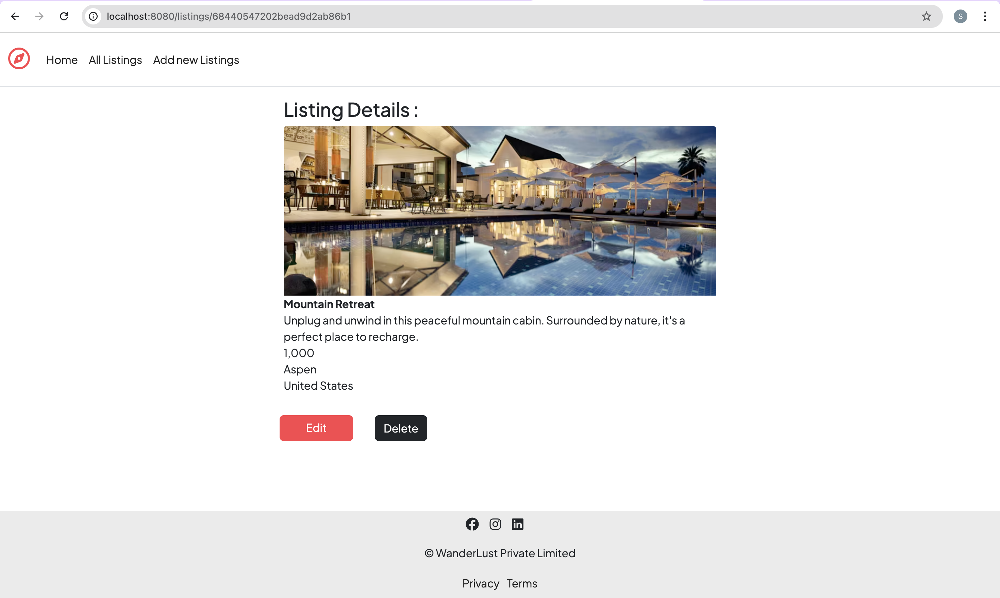
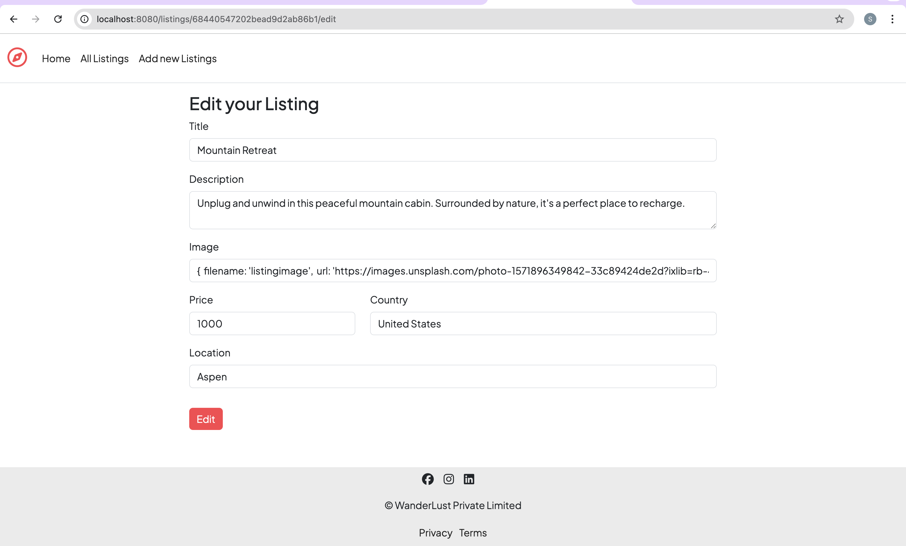

# WanderLust

WanderLust is a Node.js web application for browsing, creating, editing, and deleting travel accommodation listings. It uses Express, MongoDB, and EJS for server-side rendering.

## Features

- View all accommodation listings
- Add new listings
- Edit and delete listings
- Responsive UI with Bootstrap

## Getting Started

### Prerequisites

- Node.js
- MongoDB (local or cloud)

## 📸 Screenshots

### All Listings Page


### Listing Details Page



### Edit Listing Page



### Installation

1. Clone this repository:
   ```
   git clone https://github.com/shri2310sti/Project_WanderLust.git
   ```
2. Install dependencies:
   ```
   npm install
   ```
3. (Optional) Seed the database:
   ```
   node init/index.js
   ```

### Running the App

Start the server:

```
node app.js
```

Visit [http://localhost:8080/listings](http://localhost:8080/listings) in your browser.

## Project Structure

- `app.js` - Main application file
- `models/` - Mongoose models
- `views/` - EJS templates
- `public/` - Static files (CSS, images)
- `init/` - Database seeding scripts

Made with ❤️
